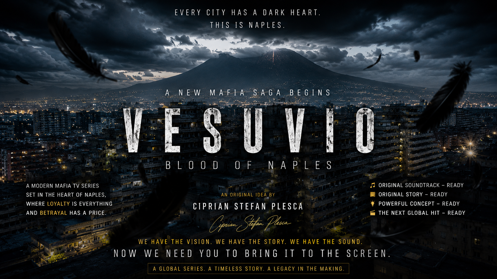

<p align="center">
  
</p>

<h1 align="center">VESUVIO: Blood of Naples</h1>
<h3 align="center">A New Mafia Saga Begins</h3>

<p align="center"><em>Every city has a dark heart. This is Naples.</em></p>

<p align="center">
  <a href="LICENSE"></a>
  
  
  
</p>

---

## 🌋 Overview

**VESUVIO: Blood of Naples** is an original modern mafia TV series
concept set in the heart of Naples, Italy — a city where **loyalty is
everything** and **betrayal has a price**. Created by **Ciprian Stefan
Plesca**, this repository is the full pitch/development package for the
project: story bible, character bible, episode guide, pilot script,
pitch deck, production and visual style bibles, original bilingual
theme track, cinematic key art, and full press/business materials.

> *We have the vision. We have the story. We have the sound.*
> *Now we need you to bring it to the screen.*

A global series. A timeless story. A legacy in the making.

---

## ✅ What's Ready

| Element | Description | Status |
|---|---|---|
| 📖 **Story Bible** | World, politics, Camorra structure, rules, vocabulary | Ready |
| 👤 **Character Bible** | 7 core characters, full psychological profiles | Ready |
| 🎬 **Episode Guide** | Season 1, 10 episodes with synopses | Ready |
| 📝 **Pilot Script** | Sample pages + full act-by-act outline | Ready |
| 📊 **Pitch Deck** | Logline, tone, audience, budget, why now | Ready |
| 🎨 **Moodbook** | Cinematography, costume, color, architecture | Ready |
| 🎥 **Production Bible** | Camera, music, editing, lighting, VFX guidelines | Ready |
| 🎵 **Original Soundtrack** | Neapolitan-dialect duet theme track | Ready |
| 🖼️ **Key Art & Trailer** | Cinematic poster + promo video | Ready |
| 📰 **Press Kit** | Press release, bio, logo, poster assets | Ready |
| 💼 **Business Materials** | Budget framework, revenue plan, investor ask | Ready |

---

## 📖 The Story

Set against the ever-present shadow of Mount Vesuvius, the series follows
a Neapolitan crime family navigating a decade of uneasy peace that is
about to shatter. **VESUVIO: Blood of Naples** blends the operatic
tradition of classic mafia sagas with a modern, grounded, prestige-drama
sensibility — rooted specifically in Neapolitan culture, language, and
geography. Full detail in the [Story Bible](docs/story_bible/Story_Bible.md)
([PDF](docs/story_bible/Story_Bible.pdf)).

## 🎧 The Sound

The theme track is written and performed in authentic **Neapolitan
dialect**, structured as a male/female duet, sitting in dark, melodic
trap territory.

- 🎵 [`assets/track_final.mp3`](assets/track_final.mp3)
- 📜 [Bilingual lyrics](docs/LYRICS_BILINGUAL.md)

## 🎨 The Visual Identity

- 🖼️ [`assets/cover_art.jpg`](assets/cover_art.jpg)
- 🎥 [`assets/promo_trailer.mp4`](assets/promo_trailer.mp4)
- 🖌️ Full [Moodbook](docs/Moodbook.md) ([PDF](docs/Moodbook.pdf))

---

## 📂 Repository Structure

```
VESUVIO/
├── README.md
├── LICENSE                   → Custom creative content license (not standard MIT)
├── CHANGELOG.md
├── ROADMAP.md
├── SECURITY.md
├── CONTRIBUTING.md
├── CODE_OF_CONDUCT.md
├── AI_USAGE.md
├── BUSINESS.md
├── INVESTORS.md
├── FESTIVALS.md
├── GITHUB_SETUP.md           → topics, releases, social preview instructions
├── docs/
│   ├── story_bible/
│   │   ├── Story_Bible.md
│   │   └── Story_Bible.pdf
│   ├── Moodbook.md / .pdf
│   ├── LYRICS_BILINGUAL.md
│   └── PROCESS_NOTE.md
├── characters/
│   ├── boss.md
│   ├── underboss.md
│   ├── wife.md
│   ├── enemy.md
│   ├── police.md
│   ├── judge.md
│   └── priest.md
├── episodes/
│   └── Season_1.md
├── scripts/
│   ├── Pilot.md
│   └── Pilot.pdf
├── pitch/
│   ├── PitchDeck.md
│   └── PitchDeck.pdf
├── production/
│   ├── camera.md
│   ├── music.md
│   ├── editing.md
│   ├── lighting.md
│   └── vfx.md
├── press/
│   ├── press_release.md / .pdf
│   ├── bio.md / .pdf
│   ├── poster.png
│   └── cover.jpg
├── media/
│   ├── screenshots/
│   ├── wallpapers/
│   └── social/social-preview.jpg
├── website/
│   └── mockups/landing-page-mockup.html
├── logos/
│   ├── logo.svg
│   └── logo.png
├── assets/
│   ├── track_final.mp3
│   ├── cover_art.jpg
│   └── promo_trailer.mp4
├── prompts/
│   └── generation_rules.txt
└── .github/workflows/
    ├── markdown-lint.yml
    ├── link-checker.yml
    └── spellcheck.yml
```

---

## 👤 Creator

**Ciprian Stefan Plesca** — original idea, story concept, and creative
direction for *VESUVIO: Blood of Naples*.

## 📄 License

This project is shared under a **custom Creative Content License**, not
standard MIT — see [`LICENSE`](LICENSE) for full terms. Credit must
always be given to **Ciprian Stefan Plesca** as the original creator.
Any commercial production or adaptation requires direct attribution and
a separate written agreement with the creator.

## 🤝 Get Involved

This repository exists to find the right collaborators — producers,
studios, directors, or composers — to bring **VESUVIO: Blood of Naples**
to the screen. See [`INVESTORS.md`](INVESTORS.md) for what's being
sought, or open an issue to get in touch.

<p align="center"><strong>A global series. A timeless story. A legacy in the making.</strong></p>
